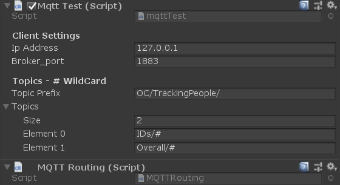
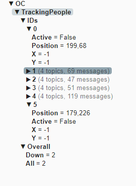

# Unity_MQTT
This is an edited version of [Unity3d_MQTT](https://github.com/vovacooper/Unity3d_MQTT) by vovacooper.  
  
I have made the variables more accessable to the user along with adding a routing script to keep the routing seperate from the main MQTT scripts.

## Usage

To use this script, first set the Client Settings 'Ip Address' to the address of your MQTT broker. The brokers port should be put in Broker_port feild. Ensure that a MQTT broker such as Mosquitto is running otherwise you'll get errors upon runtime. Ensure that you ensure the correct topics that you wish to subscribe too. 
All messages are routed throught the MQTT Routing script. Use this to cleanly breakdown the MQTT Topics and then prase the topic messages into usable data which you can then pass on to other functions or classes.

E.g.   

     if (MqttMessage.Topic.Contains("Global/Temperature")){     
     
          TemperatureControl TempCtrl = new TemperatureControl ();     
     
          int value = int.Parse(System.Text.Encoding.UTF8.GetString(MqttMessage.Message));   
     
          TempCtrl .setTemp(value );    
     
     }     

## Detail
  

#### IP Address
IP of the broker.

#### Broker_Port
Port of the broker

#### Topic Prefix
Prefix that is added to all topics. E.g. in the example above, the topics subscriped to are: OC/TrackingPeople/IDs/#

#### Topics
This is a list of all the topics you wish to subscribe too. Use # as a wildcard

